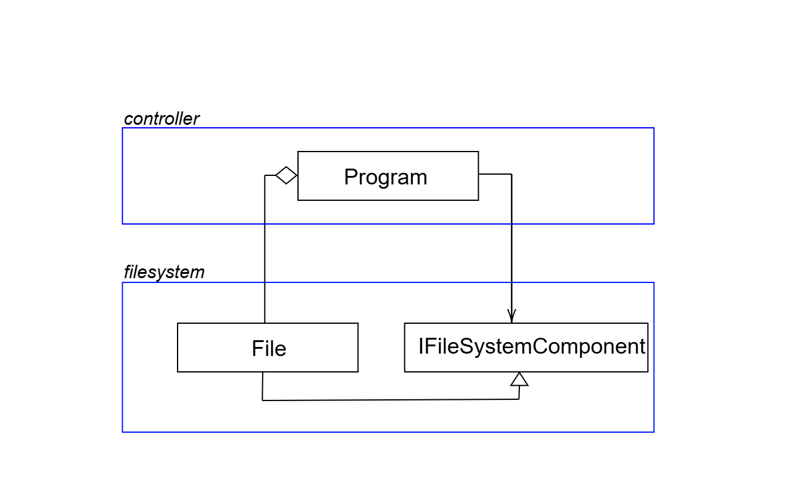

# Composite Pattern Demo: Java
## Overview

This repository contains implementation of the *Composite Design Pattern* in Java. The application simulates a file system where the files are arranged as a tree to represent the hierarchy. Each object can be treated as a composition of objects. This project considers everything as a file, distintion is made by specifying the type. This project provides a clean, well-documented example for students learning object-oriented design patterns, modern Java development practices, and software engineering best practices including testing.

## Implementation Details

### Directory Structure
```
src
| - main
|   | - java
|   |   | - controller
|   |   |   | - Program
|   |   | - filesystem
|   |   |   | - File
|   |   |   | - IFileSystemComponent
| - test
|   | - java
|   |   | - filesystem
|   |   |   | -FileTest
```

The modules in this project are as follows:

- **Program**
    - Entry point for the project. Starts the simulation of file system.

- **IFileSystemComponent**

    - Interface which defines the functions, *showDetails()* and *addFile()*, that need to be implemented in the ```File``` class. 

- **File**

    - This module is used to create the file object. This implements the ```IFileSystemComponent```.

- **FileTest** 

    - Contains tests for each of the functions in ```IFileSystemComponent```. 

## Diagram




## Getting Started

**Courtesy: https://github.com/chittur/observer-pattern-demo-java/blob/main/README.md?plain=1**

### Prerequisites

- **Java 17** or higher
- **Maven 3.8** or higher
- **Git** for version control

### Installation

1. **Clone the repository:**
   ```bash
   git clone https://github.com/Sn-G-m/composite-pattern-demo-java
   cd composite-pattern-demo-java
   ```

2. **Compile the project:**
   ```bash
   mvn clean compile
   ```

3. **Run the tests:**
   ```bash
   mvn test
   ```

4. **Run the demonstration:**
   ```bash
   mvn exec:java -Dexec.mainClass=controller.Program
   ```

### Checkstyle Rules

Key rules enforced:
- Max line length: 120 characters
- Proper indentation (4 spaces)
- Complete Javadoc for public APIs
- Consistent naming conventions
- Import organization
- No unused imports or variables


### Example Usage

```java
final IFileSystemComponent root = new File("composite-pattern-demo-java", "folder", "24 Aug 2025");
        final IFileSystemComponent javaDirectory = new File("java", "folder", "25 Aug 2025");
        final IFileSystemComponent readMe = new File("readMe", "markdown", "26 Aug 2025");
        final IFileSystemComponent programFile = new File("program", "java", "27 Aug 2025");

        root.addFile(javaDirectory);
        root.addFile(readMe);
        javaDirectory.addFile(programFile);
        root.showDetails();
```

Directory structure used in Program.
```
composite-pattern-demo-java
                        |---java
                        |       |---program
                        |---readMe
```
#### Output
```
New file added to composite-pattern-demo-java folder successfully...
New file added to composite-pattern-demo-java folder successfully...
New file added to java folder successfully...
File Name: composite-pattern-demo-java, File Type: folder, Date of creation: 24 Aug 2025
2 items found within composite-pattern-demo-java, displaying sub-file details
File Name: java, File Type: folder, Date of creation: 25 Aug 2025
1 items found within java, displaying sub-file details
File Name: program, File Type: java, Date of creation: 27 Aug 2025
java contents printed successfully...
File Name: readMe, File Type: markdown, Date of creation: 26 Aug 2025
composite-pattern-demo-java contents printed successfully...

Process finished with exit code 0

```